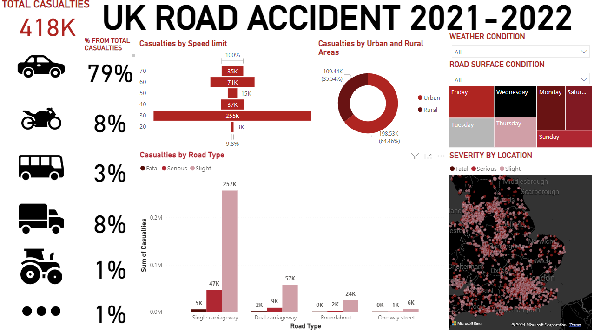

# UK Road Accident Analysis (2021-2022)

## Overview
This Power BI dashboard provides an analysis of road accidents in the UK for the years 2021-2022. It includes insights into the total casualties, accident severity, road types, and more.

## Features
- **Casualties by Vehicle Type**: Breakdown of casualties by different types of vehicles.
- **Casualties by Speed Limit**: Analysis of casualties based on speed limits.
- **Casualties by Urban and Rural Areas**: Comparison of casualties in urban vs. rural areas.
- **Casualties by Road Type**: Detailed view of casualties based on different road types.
- **Severity by Location**: Map showing the severity of accidents by location.
- **Weather and Road Surface Conditions**: Filters to analyze the impact of weather and road surface conditions on accidents.

## Screenshot

## Download
- [Download pbix Version]
- [Download PDF Version](Power BI dashboard UK road accidents.pdf)

## Data Sources
The data used in this dashboard is sourced from @Ehsan Nabatchian [repo](https://github.com/Ethann93/UK-ROAD-ACCIDENT-ANALYSIS-Dashboard-).

## Contact
For reviews or feedback, please contact [salameazb@gmail.com](salameazb@gmail.com).
